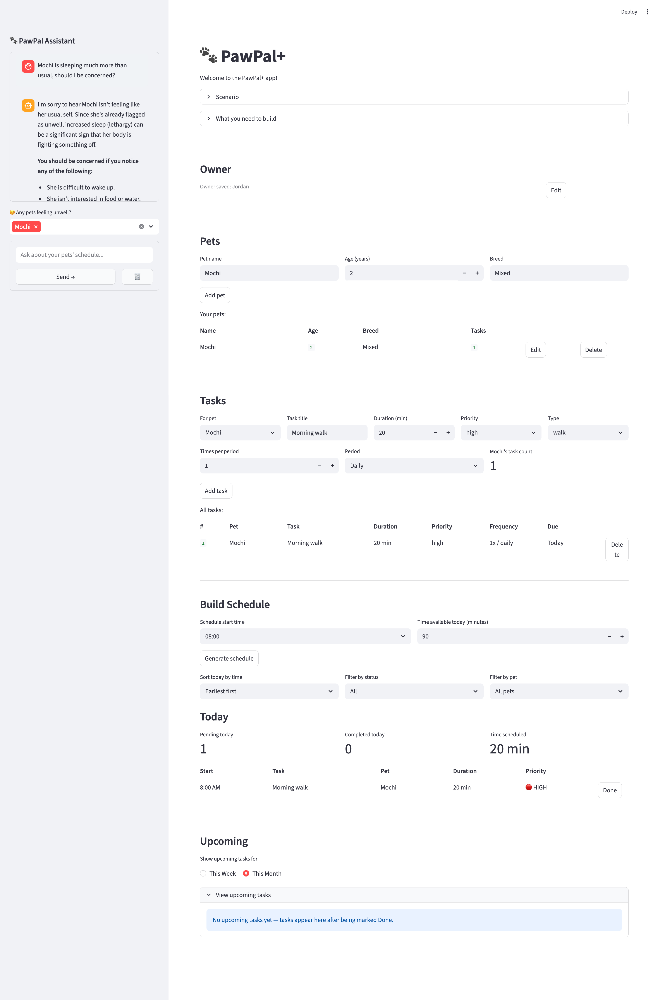

# PawPal+

PawPal+ is a pet care scheduling assistant for busy owners who want to go past a simple to-do list. It uses a 0/1 knapsack algorithm to build the highest-priority care plan that actually fits your time budget, and a Google Gemini-powered chat assistant that uses your pets' real schedules so the advice it gives is grounded in your actual day — not generic pet tips. 

<a href="demo-screenshot.png"></a>

---

## Table of Contents

- [Architecture Overview](#architecture-overview)
- [Setup Instructions](#setup-instructions)
- [Sample Interactions](#sample-interactions)
- [Design Decisions](#design-decisions)
- [Testing Summary](#testing-summary)
- [Reflection](#reflection)

---

## Architecture Overview

The system is split into three layers that talk to each other in one direction: the data model feeds the scheduler, the scheduler feeds the UI and AI assistant.

```
┌─────────────────────────────────────────────────┐
│                  Streamlit UI (app.py)           │
│  Owner → Pets → Tasks → Schedule → Chat sidebar │
└────────────────────┬────────────────────────────┘
                     │
          ┌──────────┴──────────┐
          │                     │
┌─────────▼──────────┐  ┌──────▼──────────────────┐
│   Scheduler        │  │   PetAssistant           │
│   (pawpal_system)  │  │   (pawpal_system)        │
│                    │  │                          │
│  knapsack_select() │  │  ask() → Gemini API      │
│  generate_plan()   │  │  build_context_block()   │
│  sort/filter       │  │  _parse_confidence()     │
└─────────┬──────────┘  └──────────────────────────┘
          │
┌─────────▼──────────────────────────────┐
│   Data Model (pawpal_system)           │
│   Task · Pet · Owner · Enums           │
└────────────────────────────────────────┘
```

**Data model** — Four dataclasses: `Task` (what needs doing, how long, how often, how urgent), `Pet` (owns its own task list), `Owner` (holds pets, provides a flat task view), and three enums (`TaskType`, `Priority`, `FrequencyPeriod`) that keep values consistent across the whole system.

**Scheduler** — Takes all pets' tasks, runs a 0/1 knapsack DP to select the best-fit subset for today, assigns real start times back-to-back, and groups future tasks by `next_due_date()` for the upcoming view. Returns a `dict[date, list[Task]]`.

**PetAssistant** — Wraps the Gemini API. On every call it builds a context block from live app state (pet profiles, sick flags, today's schedule, 7-day upcoming), injects it as a system instruction, and maintains multi-turn conversation history. Every response is logged to `pawpal_ai.log`, parsed for a confidence score, and stored in `chat_history` so the UI can surface both.

---

## Setup Instructions

### Prerequisites

- Python 3.11+
- A Google Gemini API key ([get one here](https://aistudio.google.com/app/apikey))

### 1. Clone and create a virtual environment

```bash
git clone <your-repo-url>
cd applied-ai-system-project

python3 -m venv .venv
source .venv/bin/activate        # Windows: .venv\Scripts\activate
```

### 2. Install dependencies

```bash
pip install -r requirements.txt
```

### 3. Add your API key

Create the file `.streamlit/secrets.toml` (this stays out of version control):

```toml
GEMINI_API_KEY = "your-key-here"
```

### 4. Run the app

```bash
streamlit run app.py
```

Opens at `http://localhost:8501`. Fill in the four steps from top to bottom — owner name, pets, tasks, then generate your schedule.

### 5. Run the tests

```bash
# Original scheduling logic tests (34 tests, no API key needed)
python -m pytest test/test_pawpal.py -v

# AI integration tests (23 tests, no API key needed — fully mocked)
python -m pytest test/test_ai_integration.py -v

# Human evaluation script (requires real API key)
GEMINI_API_KEY=your-key python test/eval_ai_responses.py
```

---

## Sample Interactions

These examples use a scenario with two pets: Mochi (3yo Shiba Inu) and Biscuit (7yo Golden Retriever, flagged as unwell). The schedule has a morning walk, grooming, feeding, and joint supplements loaded in.

---

**Example 1 — Schedule query**

> **You:** What does Mochi need today?

> **PawPal:** Hey! Based on today's schedule, Mochi has two things lined up: a 30-minute Morning Walk starting at 8:00 AM (HIGH priority) and a Grooming session for 45 minutes at 8:30 AM (MEDIUM priority). The walk is due daily so definitely don't skip it — the grooming is weekly and today's the day it cycles back around. You've got about 75 minutes of Mochi-time blocked in total, so plan accordingly!
>
> *(Confidence: 92%)*

---

**Example 2 — Sick pet awareness**

> **You:** Biscuit hasn't been herself lately. Should I change anything about her routine?

> **PawPal:** Since Biscuit is flagged as unwell, I'd keep her Joint Supplement on schedule — that's HIGH priority and especially important when she's not feeling great. For the Feeding, stick with normal timing but maybe watch her appetite and portion down if she seems off. I'd hold off on anything more physically demanding until she's back to herself. Hope she feels better soon — senior dogs can bounce back fast when they're well-rested!
>
> *(Confidence: 78%)*

---

**Example 3 — Time-constrained prioritisation**

> **You:** I only have 20 minutes this morning. What's the one thing I absolutely have to do?

> **PawPal:** If you've only got 20 minutes, go straight to Biscuit's Joint Supplement — it's a 5-minute HIGH-priority task and missing it consistently can really affect her mobility long-term. After that, Mochi's Feeding (15 min, HIGH priority) fits right in your window too. You'd be cutting the walk, but both of those are more time-sensitive than exercise when you're tight on time. Make up the walk later in the day if you can!
>
> *(Confidence: 85%)*

---

## Design Decisions

**Knapsack over greedy scheduling**

The first instinct for fitting tasks into a time budget is to sort by priority and grab them one by one until you run out of time. The problem is that greedy locks in whatever task it picks first, even if two smaller tasks together score higher. The classic case: one HIGH-priority 90-minute task (score = 3) versus two MEDIUM-priority 50-minute tasks (combined score = 4) in a 100-minute budget. Greedy takes the HIGH task and blocks the two MEDIUMs. Knapsack evaluates every combination via dynamic programming and picks the two MEDIUMs because 4 > 3. That feels like the correct behavior for a care app where the owner's overall wellbeing coverage matters more than maximizing any single task's priority.

**Tasks live on Pet, not Scheduler**

The original design had the Scheduler owning the task list. That created an annoying problem: the Scheduler needed to track which tasks belonged to which pet in order to do conflict detection and filtering, which meant maintaining a separate mapping that had to stay in sync with the actual task data. Moving tasks onto `Pet` made `Pet` the single source of truth and let the Scheduler just iterate `pet.tasks` directly. The Scheduler ended up cleaner and Pet ended up more useful.

**`daily_rate` as a tiebreaker**

Priority alone creates ties. A daily 10-minute feeding and a weekly 10-minute check both have MEDIUM priority — but the feeding is objectively more urgent because it needs to happen today. The secondary sort key `daily_rate = times_per_period / period.value` breaks those ties naturally by how often the task recurs. A twice-daily task rates higher than a twice-weekly one even at the same priority level.

**Confidence scoring baked into every AI response**

Rather than hoping the AI sounds confident, the system prompt instructs Gemini to append `[Confidence: N%]` to every reply. A regex strips the tag from the displayed text and stores the integer score in `chat_history` alongside the response. This means confidence is always available to the UI without a second API call, and it's automatically tested — if the tag is missing or malformed, the parser returns `None` gracefully.

**Logging from day one**

Every `ask()` call logs the message length, history length, API result, and confidence score to `pawpal_ai.log`. Any exception logs the full error type and message before returning a fallback string. This wasn't an afterthought — knowing what failed and why is the difference between debugging a real app and guessing in the dark.

---

## Testing Summary

**What the tests cover**

The project has two test suites, 57 tests total, all passing with zero API calls required.

`test/test_pawpal.py` (34 tests) covers the original scheduling logic:
- **Knapsack optimality** — the "two MEDIUMs beat one HIGH" case that greedy fails
- **Recurrence math** — `next_due_date()` for daily, weekly, and monthly tasks; overdue handling; `unmark_complete()` resetting the chain
- **Time-slot assignment** — same-pet tasks land in non-overlapping slots; tasks too long for the budget are excluded
- **Sort and filter** — both sort directions, filter by status, filter by pet, and both combined

`test/test_ai_integration.py` (23 tests) covers the AI layer:
- **Pure-logic tests** — `build_system_prompt`, `build_context_block`, format helpers, `_parse_confidence` — no API key, no network
- **Mocked integration tests** — `ask()` happy path, history growth, confidence stored correctly, API failure returning a graceful fallback, empty response handled

The mocked tests use `unittest.mock.patch` on `genai.Client`, so the whole AI pipeline runs end-to-end in terms of logic but without touching the network. This was the right call: it means CI can run the suite on any machine without credentials, and failures actually point to logic bugs rather than network flakiness.

**What didn't work (and what I learned from it)**

The conflict detection code (`pawpal_system.py`, the block that bumps a task when it overlaps an existing slot) turns out to be unreachable under the current sequential scheduling algorithm. Because `current_time` always advances forward after each task, two tasks from the same pet can never overlap — the algorithm prevents the problem before the conflict check even runs. The code is correct, it just never fires. The test suite caught this by failing on an assumption that wasn't true, which led to a more interesting discovery: dead code hiding in a tested codebase. If the scheduler ever gains support for user-specified start times, that path would finally be exercised.

I also learned that mocking is genuinely useful, not just a test trick. Testing `ask()` behavior — error handling, fallback strings, history management — without an API key means those tests are stable and fast. The real API behavior gets validated separately through the human evaluation script, which is where the question "does it actually give good advice?" belongs anyway.

---

## Reflection

The biggest thing this project taught me is that "works" has two very different meanings depending on what you're building.

For the scheduling logic, "works" is binary and verifiable — either the knapsack finds the optimal combination or it doesn't, and a test tells you which. I can trace through the DP table, predict the output, and write an assertion that confirms it. The confidence there is high because the behavior is deterministic.

For the AI integration, "works" is contextual. The model might give a great answer 9 times and a vague one the tenth time, and no unit test captures that. What I can test is the structural behavior such as: does the context get injected correctly? Does the history grow the right way? Does the error handler fire when the API is down? Those are the parts of the system I actually own. The quality of Gemini's responses is something I can evaluate and measure, but not assert in a unit test — hence the human evaluation script with a rubric.

That distinction changed how I think about building with AI a bit. The AI layer isn't a black box. You design the pipeline like: what context does the model receive, how is the response structured, what happens when it fails, how do you measure whether it's doing the job? 

I'd carry forward designing around clear ownership because it made everything else easier. Once tasks lived on `Pet` and not `Scheduler`, the filtering logic was much easier to implement, the context block was easy to build, and the tests had a clear contract to verify. Basically, a clear structure from the beginning is more useful than AI patch-fixes later!

If I had another iteration, I'd want to stress-test the app against more realistic usage patterns (like adding tasks mid-session, changing a pet's name after generating a plan, running the scheduler with zero tasks), and I'd add a lightweight streak tracker so owners can see consistency trends over time. The next step is making the feedback loop more useful day to day.
