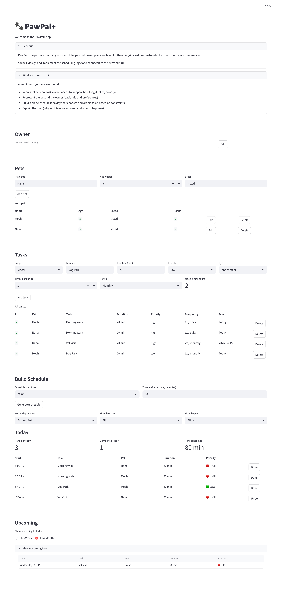

# 🐾 PawPal+

**PawPal+** is a pet care scheduling assistant that helps busy pet owners stay on top of their furry friends' daily needs. Tell it who your pets are, what they need, and how much time you have — and it'll build the smartest possible plan for your day!

---

## Demo
<a href="demo-screenshot.png" target="_blank"></a>

## 🚀 Getting Started

### 1. Set up your environment

```bash
python3 -m venv .venv
source .venv/bin/activate  # Windows: .venv\Scripts\activate
pip install -r requirements.txt
```

### 2. Launch the app

```bash
streamlit run app.py
```

Your browser will open automatically at `http://localhost:8501`. 🎉

---

## 🗺️ How to Use PawPal+

The app walks you through four steps from top to bottom. Fill each one out in order and you'll have a personalized schedule in no time!

---

### Step 1 — Enter Your Name 👤

Type in your name and hit **Save owner**.

> **Example:** `Jordan`

Once saved, your name appears at the top of the section. You can always click **Edit** to change it later — no harm done!

---

### Step 2 — Add Your Pets 🐶🐱

Fill in your pet's name, age, and breed, then click **Add pet**. Repeat for as many pets as you have!

| Field | Example |
|-------|---------|
| Pet name | `Mochi` |
| Age | `3` |
| Breed | `Shiba Inu Mix` |

Your pets will appear in a list below the form. Each row has:
- **Edit** — fix a typo or update their age
- **Delete** — remove a pet (this also removes all their tasks!)

> 💡 **Tip:** PawPal+ supports multiple pets! Add all of them so the scheduler can plan everyone's care together.

---

### Step 3 — Add Tasks 📋

For each pet, describe what needs to get done. Every task needs:

| Field | What it means | Example |
|-------|---------------|---------|
| **For pet** | Which pet this task belongs to | `Mochi` |
| **Task title** | A short name for the task | `Morning Walk` |
| **Duration (min)** | How long it takes | `30` |
| **Priority** | How important it is | `high` |
| **Type** | Category of care | `walk` |
| **Times per period** | How often it repeats | `1` |
| **Period** | The time window for that frequency | `Daily` |

Click **Add task** and it appears in the task list below. The task counter next to the form updates automatically to show how many tasks your pet has.

#### Frequency examples

| What you want | Times per period | Period |
|---------------|-----------------|--------|
| Once a day | `1` | `Daily` |
| Twice a day | `2` | `Daily` |
| Three times a week | `3` | `Weekly` |
| Twice a month | `2` | `Monthly` |

> 💡 **Tip:** The **Due** column in the task list shows when each task is next due. Right after adding a task it says "Today" — that's normal! It updates as soon as you start marking tasks done.

You can also **Delete** any task from the list if your pet's routine changes.

---

### Step 4 — Generate Your Schedule 📅

Set two things:
- **Schedule start time** — when your care session begins (e.g. `8:00 AM`)
- **Time available today** — your total time budget in minutes (e.g. `90`)

Then hit **Generate schedule**!

> **Example:** You have 90 minutes starting at 8 AM. Mochi needs a 30-minute walk, 10-minute feeding, and 20-minute enrichment play. The scheduler picks the best combination that fits and assigns each task a real start time.

---

## 📋 Reading Your Schedule

### Today

The Today section shows everything scheduled for right now, with three summary numbers at the top:

- **Pending today** — tasks still waiting to be done
- **Completed today** — tasks you've already finished 🎉
- **Time scheduled** — total minutes the plan will take

Each row shows the **start time**, task name, which pet it's for, how long it takes, and its priority level (`🔴 HIGH`, `🟡 MEDIUM`, `🟢 LOW`).

When you finish a task, hit **Done** — it moves to the bottom of the list with a ✓ checkmark. Changed your mind? Hit **Undo** to put it back.

Once every task is checked off, you'll see a big **"All tasks for today are done!"** banner. You've earned it! 🎊

### Upcoming

The Upcoming section shows what's coming later this week or month, based on each task's recurrence schedule. After you mark a task done, its next occurrence automatically appears here on the right future date.

Use the **This Week / This Month** toggle to control how far ahead you're looking.

---

## 🔍 Sort & Filter

Above the Today table, three controls let you slice and dice the plan:

| Control | Options | What it does |
|---------|---------|--------------|
| **Sort today by time** | Earliest first / Latest first | Reorders the today table |
| **Filter by status** | All / Pending only / Done only | Hides tasks you don't want to see |
| **Filter by pet** | All pets / individual pet name | Shows only one pet's tasks |

> **Example:** You have two dogs and only want to see what's left for Mochi. Set **Filter by pet** → `Mochi` and **Filter by status** → `Pending only`. Done!

---

## 🧠 How the Scheduler Thinks

PawPal+ doesn't just grab tasks in order until time runs out — it's smarter than that! Here's a peek at what's happening under the hood:

## ✨ Features - Smart Scheduling

- **Priority-based knapsack scheduling** — instead of grabbing tasks in order until time runs out, the scheduler finds the combination of tasks with the highest total priority that actually fits your time budget. A long, low-priority task won't accidentally push out two shorter, more important ones.

- **Interval-based recurrence** — every task tracks when it was last completed and calculates its next due date automatically. A task done twice a week becomes due again in 3.5 days; a task done twice a month comes back in 15 days. Tasks that have never been done are always treated as due today.

- **Multi-day lookahead** — the schedule isn't just a flat list for today. It groups tasks by due date across a 30-day window, so you can see what's coming up this week or this month — and when you mark something done, the next occurrence shows up in the right future slot immediately.

- **Time-slot assignment** — every task selected for today gets a real start time, not just an order. Tasks are placed back-to-back starting from your chosen schedule start time, so the plan is always clock-ready.

- **Sort by start time** — reorder today's tasks by earliest or latest start time with one click. Useful when you want to tackle the hardest things first, or see what's left at the end of the day.

- **Filter by status or pet** — narrow the schedule down to just pending tasks, just completed ones, or just one specific pet. Filters stack, so "Mochi's pending tasks" is two clicks away.

- **Completion tracking with undo** — mark a task done right from the schedule. If you tapped the wrong one, hit Undo to put it back in the pending list and the plan adjusts instantly.

- **Conflict warnings** — if the scheduler ever needs to move a task to avoid an overlap for the same pet, it surfaces a warning message explaining exactly where the task was moved and why, so nothing quietly disappears from your day.

### Testing PawPal+

The command to run the tests:

```bash
python -m pytest test/test_pawpal.py -v
```

There are 34 tests total, split across four areas:

- **Knapsack** — checks that the algorithm actually finds the best combination of tasks, not just the first ones that fit. The key case: two medium-priority tasks that together outscore one high-priority task when the budget is tight.
- **Time slots and budget** — verifies that same-pet tasks always land in non-overlapping slots, that tasks too long for the budget get excluded, and that different pets can share time without any conflict.
- **Recurrence** — confirms that next due dates calculate correctly for daily, weekly, and monthly tasks, that overdue tasks show up as due today, and that unmarking a task resets it back to "never done."
- **Sort and filter** — makes sure sort by start time works in both directions, and that filtering by completion status or pet name (or both together) returns exactly the right subset.

**Confidence Level: 4/5**

The core scheduling logic — knapsack selection, recurrence math, and sort/filter — is well-covered and all 34 tests pass. The one thing keeping this from five stars is that the conflict detection code (the part that bumps a task if it overlaps with another same-pet slot) turns out to be unreachable with the current sequential time-slot algorithm, so it goes untested. It's not broken, just never triggered. If the scheduling strategy ever changes to support user-specified start times, that code would need its own tests.

